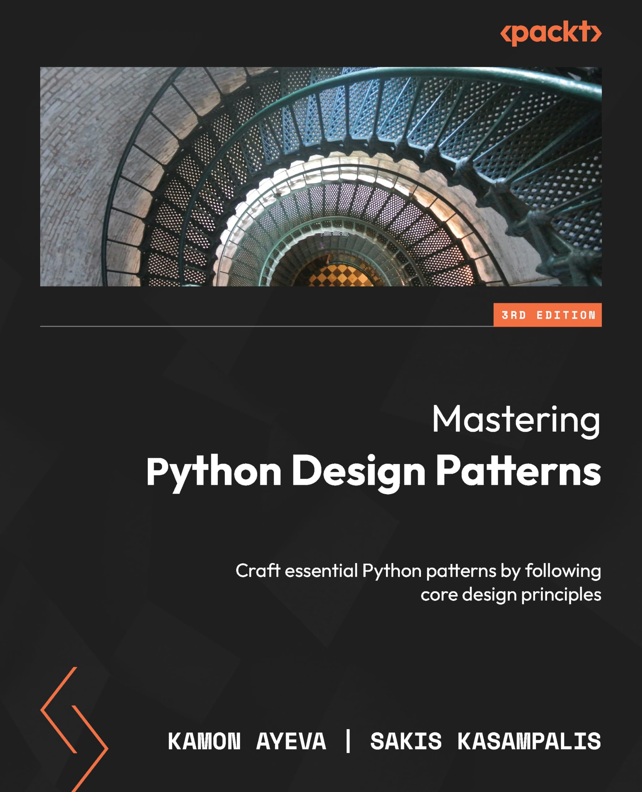

# Mastering Python design patterns

_GitHub_ - [https://github.com/PacktPublishing/Mastering-Python-Design-Patterns-Third-Edition](https://github.com/PacktPublishing/Mastering-Python-Design-Patterns-Third-Edition)

# Chapter 01: Foundational Design Principles

- [Encapsulation](./chap01/base.ipynb)
- [Composition](./chap01/base.ipynb)
- [Interfaces, Not Implementations](./chap01/base.ipynb)
- [Loose Coupling](./chap01/base.ipynb)

# Chapter 02: SOLID Principles

- [Single responsibility principle (SRP)](./chap02/base.ipynb)
- [Open-closed principle (OCP)](./chap02/base.ipynb)
- [Liskov substitution principle (LSP)](./chap02/base.ipynb)
- [Interface segregation principle (ISP)](./chap02/base.ipynb)
- [Dependency inversion principle (DIP)](./chap02/base.ipynb)

# Chapter 03: Creational Design Patterns

- The [factory design pattern](./chap03/factory.ipynb)
- The [builder design pattern](./chap03/builder.ipynb)
- The [prototype design pattern](./chap03/prototype.ipynb)
- The [singleton design pattern](./chap03/singleton.ipynb)
- The [object pool design pattern](./chap03/object-pool.ipynb)

# Chapter 04: Structural Design Patterns

- The [adapter design pattern](./chap04/adapter.ipynb)
- The [decorator design pattern](./chap04/decorator.ipynb)
- The [bridge design pattern](./chap04/bridge.ipynb)
- The [facade design pattern](./chap04/facade.ipynb)
- The [flyweight design pattern](./chap04/flyweight.ipynb)
- The [proxy design pattern](./chap04/proxy.ipynb)

# Chapter 05: Behavioral Design Patterns

- The [chain of responsibility design pattern](./chap05/chain.ipynb)
- The [command design pattern](./chap05/commands.ipynb)
- The [observer design pattern](./chap05/observer.ipynb)
- The [state design pattern](./chap05/state.ipynb)
- The [interpreter design pattern](./chap05/interpreter.ipynb)
- The [strategy design pattern](./chap05/strategy.ipynb)
- The [memento design pattern](./chap05/memento.ipynb)
- The [iterator design pattern](./chap05/iterator.ipynb)
- The [template design pattern](./chap05/template.ipynb)
